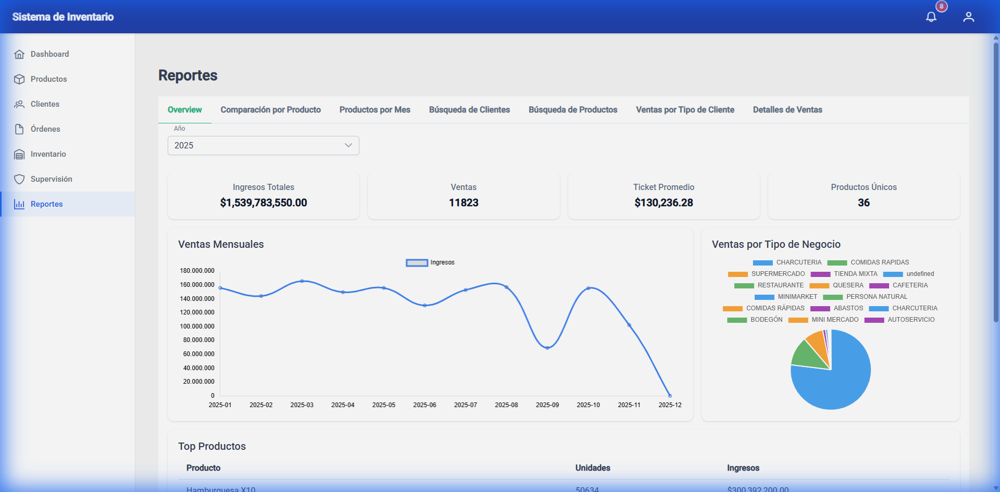
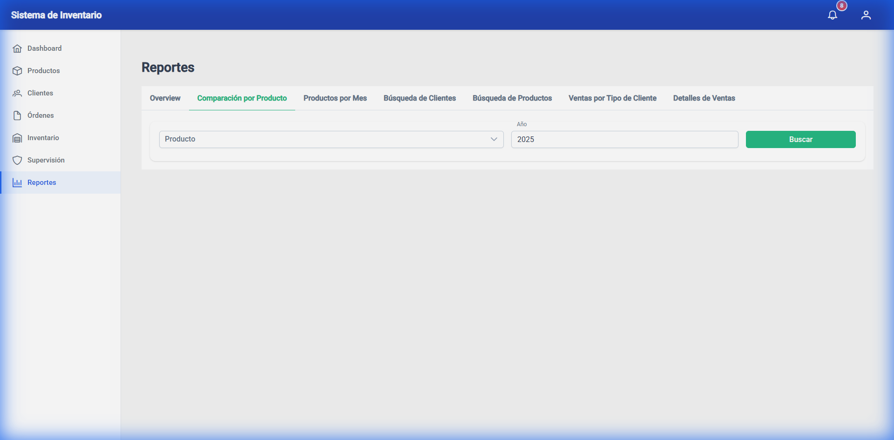
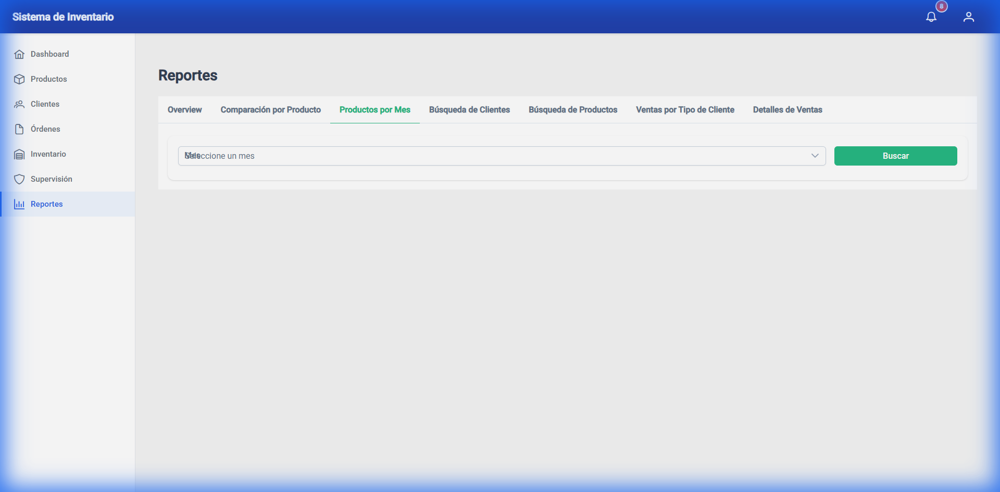
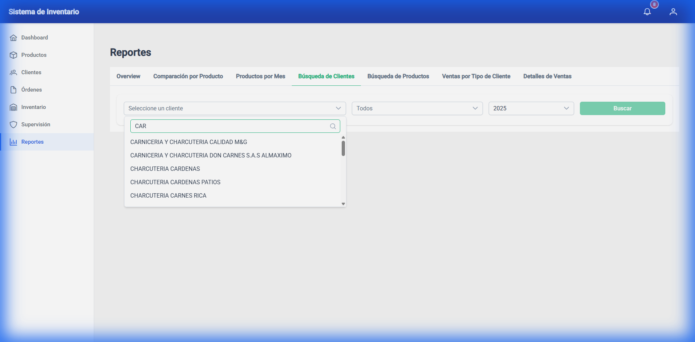
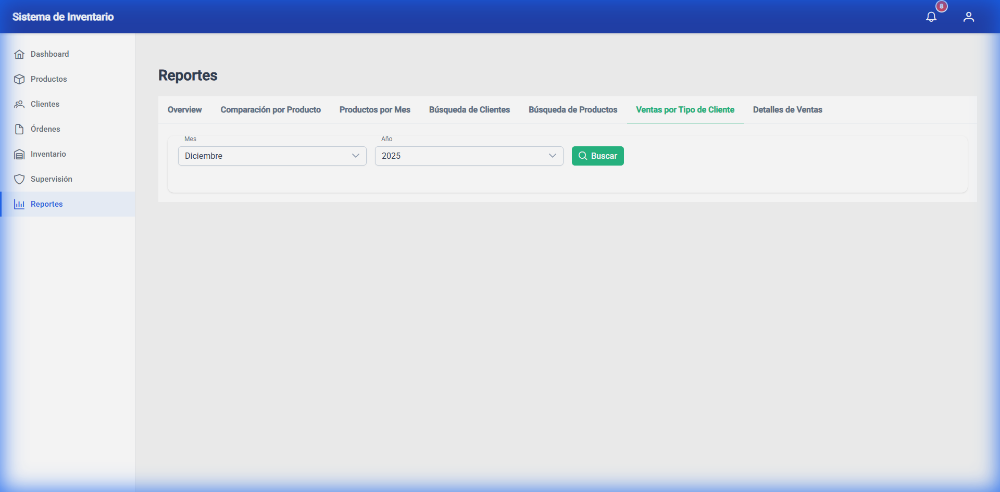
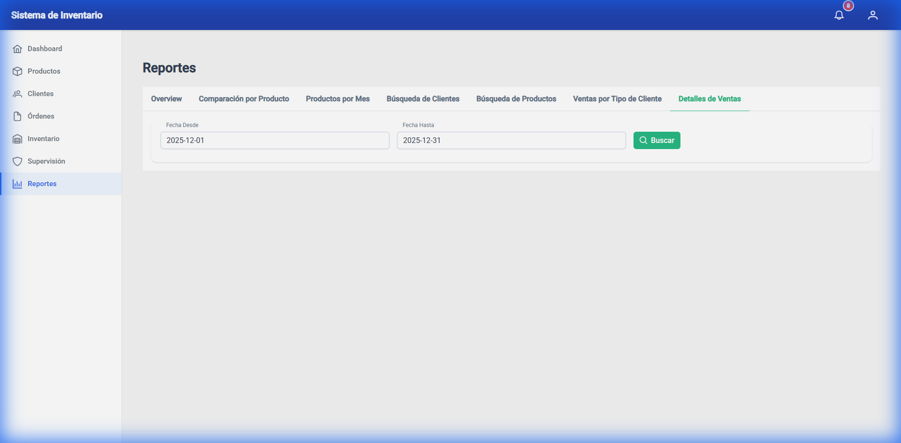

# Manual de Usuario: Módulo de Reportes

Este documento describe las funcionalidades del "Dashboard Proforma" dentro del módulo de Reportes del sistema *El Castillo del Pan*.

## 1. Visión General (Dashboard)
La pantalla principal ofrece una vista rápida de las métricas clave, como ingresos mensuales y ventas por categoría.

## 2. Funcionalidades por Pestaña

### Comparación de Productos
Permite comparar el rendimiento de ventas de un producto específico a lo largo de los meses de un año seleccionado.
- **Uso**: Seleccione el producto y el año en los filtros superiores.
- **Resultado**: Gráfico de líneas mostrando la tendencia.

### Productos por Mes
Muestra el "Top 10" de productos más vendidos en un mes específico.
- **Uso**: Seleccione el mes deseado.
- **Resultado**: Gráfico de barras horizontal con los productos líderes.

### Búsqueda de Clientes
Funcionalidad clave para consultar el historial de clientes.
- **Selector de Clientes**: Ahora lista **todos los clientes activos** del sistema, independientemente de si han comprado recientemente.
- **Filtros**: Puede filtrar por nombre escribiendo en el desplegable.
- **Resultados**: Muestra la lista de ventas (tickets) del cliente seleccionado en el rango de fechas.
- **Notificaciones**: Si el cliente no tiene compras, el sistema mostrará un mensaje emergente ("Toast") indicando que no hay resultados.

### Búsqueda de Productos
Buscador global para encontrar transacciones relacionadas con un producto.
- **Filtro**: Escriba el nombre del producto (min. 2 caracteres).
- **Alcance**: Puede acotar por mes/año o buscar en todo el histórico.

### Ventas por Tipo de Cliente
Análisis de ingresos segmentado por tipo de negocio (ej. Charcutería, Supermercado, General).
- **Visualización**: Gráfico de torta (Pie Chart) interactivo.

### Detalles de Ventas
Reporte tabular detallado de todas las ventas en un periodo.
- **Filtros**: Rango de fechas (Fecha Desde - Fecha Hasta).
- **Acciones**:
    - **Ver Detalle**: Cada fila tiene un botón para abrir un diálogo emergente.
    - **Contenido del Diálogo**: Lista desglosada de productos de esa venta, con cantidad, precio unitario y subtotal.

#### Detalle de Ticket
Al hacer clic en el botón de detalle, se muestra el desglose:

---
*Documento revisado el 08/12/2025.*
